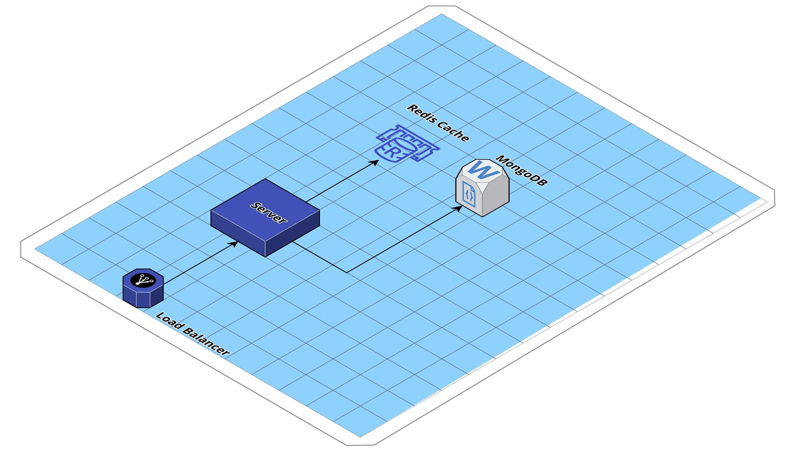
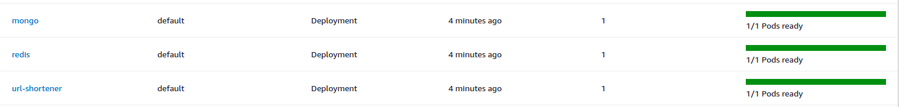

# URL Shortener

A highly scalable URL shortener API written in golang.

<p align="center">

</p>


## Tech Stack

- Golang :heavy_check_mark:
- MongoDB :heavy_check_mark:
- Redis :heavy_check_mark:
- Terraform :heavy_check_mark:
- EKS :heavy_check_mark:

## Production environment

The production infrastructure was built as code using terraform. To reproduce this environment yourself, there are a few requirements needed:

- An **AWS account**, with programatic access.
- **Terraform CLI** installed (For this project I've used version 0.12.24).
- **Kubernetes CLI** installed.

After everything is set up properly, go through the following steps:

Enter the terraform source code directory
```bash
cd terraform
```
Initialize the working directory and download all dependecies with
```terraform
terraform init
```

Generate an execution plan 
```terraform
terraform plan -out=plan.apply
```

Apply
```terraform
terraform apply plan.apply
```

Generally, EKS cluster takes about 15 minutes to create. When is done, a new file named `kubeconfig_url-shortener-production-cluster` 
should be seen in the current directory. This file will be used to access the brand-new Kubernetes cluster.

To get access to the EKS cluster
```bash
export KUBECONFIG="${PWD}/kubeconfig_url-shortener-production-cluster"
```

Now let's start up our pods and get everything running
```kubectl
kubectl apply -f ./kubernetes 
```

When it's complete, three newly created pods should be running: A Redis instance for cashing hot URLs, a MongoDB as the main data storage and the URL Shortener API
```kubectl
kubectl get pods 
```

On the EKS interface, you can also see if everything went correctly by entering the url shortener cluster
<p align="center">

</p>


In order to test it out, get the load balance endpoint by
```kubectl
kubectl describe service url-shortener
```

That's is! Now you can start generating short URLs by calling the API endpoints. :rocket:

## Local environment

### Run with docker-compose

For local development, you can start everything up using docker-compose by running

```bash
make all
```

### Minikube

You can also run the application locally with kubernetes using minikube.

First of all, start the minikube cluster

```
minikube start
```

Apply everything by running

```
kubectl apply -f kubernetes
```

You can watch all pods coming alive with

```
kubectl get pods -w
```

To find the application URL exposed in our cluster by the service, type

```
minikube service url-shortener
```

When you're done, delete the application with

```
kubectl delete -f kubernetes
```

And also delete the minikube cluster

```
minikube delete --all
```

## Endpoints

### POST /users

#### Request

```bash
curl -XPOST http://localhost:3000/v1/users --header "Content-Type: application/json"  --data '{
    "name": "Jack",
    "email": "jack@email.com"
}'
```

#### Response

```json
{
  "id": "5fd6ac5c6884b412d6ec1475",
  "name": "Jack",
  "email": "jack@email.com",
  "updated_at": 1607904348,
  "created_at": 1607904348
}
```

### GET /users/:id

#### Request

```bash
curl http://localhost:3000/v1/users/1
```

#### Response

```json
{
  "id": "5fd6ac5c6884b412d6ec1475",
  "name": "Jack",
  "email": "jack@email.com",
  "updated_at": 1607904348,
  "created_at": 1607904348
}
```

### POST /short_urls

#### Request

```bash
curl -XPOST http://localhost:3000/v1/short_urls --header "Content-Type: application/json"  --data '{
    "original_url": "https://really-long-website-url.com",
    "user_id": "5fd6ac5c6884b412d6ec1475",
    "expires_at": 100
}'
```

#### Response

```json
{
  "hash": "DWv53EaGg",
  "original_url": "https://really-long-website-url.com",
  "user_id": "5fd6ac5c6884b412d6ec1475",
  "expires_at": 100,
  "created_at": 1607904409
}
```

### GET /short_urls/:hash

#### Request

```bash
curl http://localhost:3000/v1/short_urls/DWv53EaGg
```

#### Response

```json
{ "original_url": "https://really-long-website-url.com" }
```

### GET /short_urls/:hash/redirect

#### Request

```bash
curl http://localhost:3000/v1/short_urls/DWv53EaGg/redirect
```

#### Response

It redirects to the original URL
